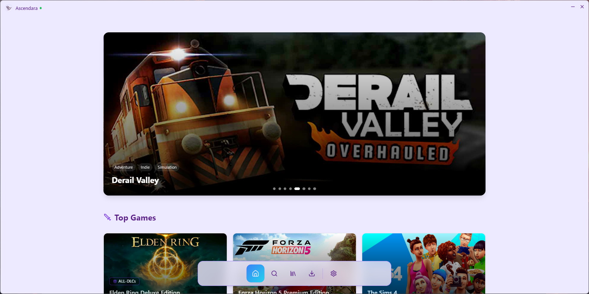
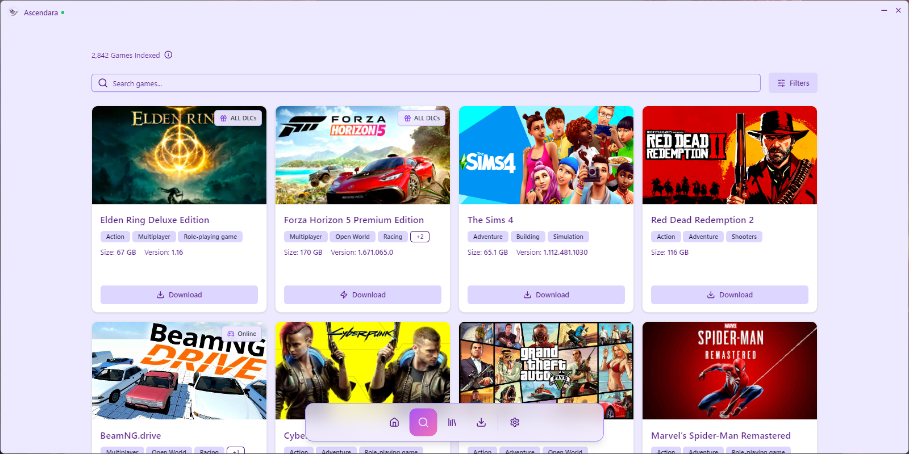
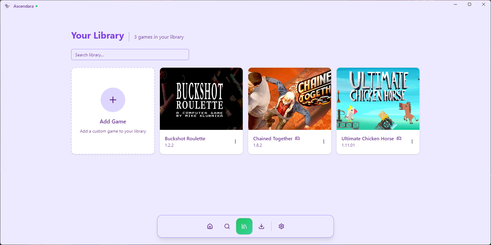
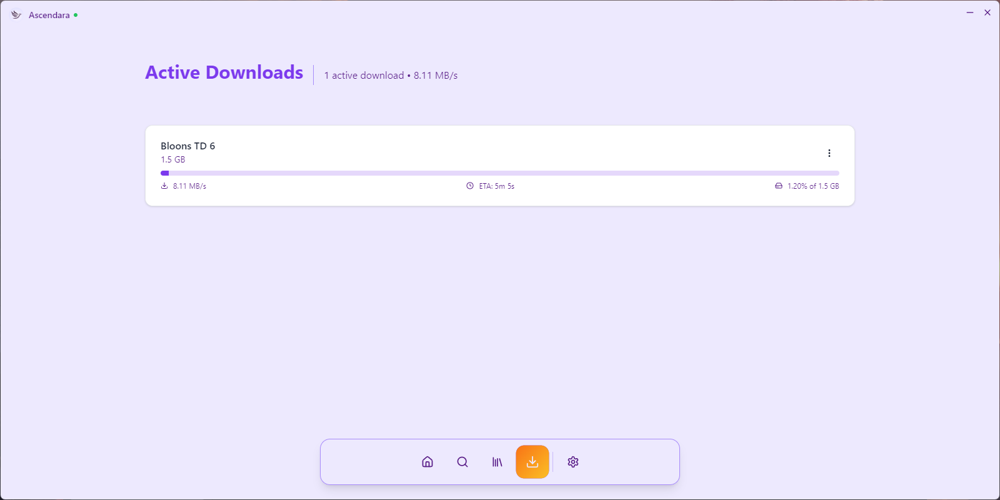

<div align="center">
    
    <h1>Ascendara</h1>
    <p><em>The best way to test games before you buy them.</em></p>
    <p>
        
        
        <a href="https://ascendara.app/"></a>
        <a href="./LICENSE"></a>
    </p>
</div>

## 🎮 About

#### The website, API, and application were all completely developed and stay maintained by a [single developer](https://tago.works).

Ascendara simplifies your pirating experience by providing a seamless way to download, manage, and play the pre-installed games. No more hassle with extracting, installing, or moving files. The game library is powered by a custom webscraper, currently featuring games from [STEAMRIP](https://steamrip.com/), with plans to expand to more sources.

## ✨ Features

- 🌐 Support for 12 total languages
<details>
<summary>Click to expand</summary>
    
- English 
- Spanish
- French
- German
- Italian
- Chinese
- Arabic 
- Hindi
- Bengali
- Portuguese
- Russian 
- Japanese
  
</details>

- 🎯 2 Clicks to start game downloads
- 📖 Detailed documentation for users & developers
- 📚 Organized game library management
- 🔍 Smart search functionality
- 🔄 Regular updates
- 🎨 Customizable themes

## 🖼️ Preview

### Download Latest Version
🚀 [Download the Ascendara Installer](https://ascendara.app/)

<details>
<summary>📸 Screenshots</summary>

### Home Page


### Search Page


### Library Page


### Downloads Page


</details>

## 🤝 Contributing 

Contributing to Ascendara is the best way to get your desired features, bug fixes, or improvements into the official build! When your contribution is accepted, your changes will be prominently featured in the Ascendara changelogs, giving you recognition for your valuable input to the project. Learn how to contribute to Ascendara [here](https://ascendara.app/docs/getting-started/contributing).

## 🛠️ Building from Source

For detailed instructions, check out the [Developer Docs](https://ascendara.app/docs/developer/build-from-source).

### Prerequisites
Before building, ensure you have all required dependencies. [View full requirements](https://ascendara.app/docs/developer/build-from-source#prerequisites).

### Quick Start

> ⚠️ **Note:** Some API features like reporting and analytics services will not work on the public version of the app. Additionally, you will not be able to run games in development mode. Check the [Developer Docs](https://ascendara.app/docs/developer/build-from-source#important-limitations) for more information.

1. **Clone the Repository**
   ```sh
   git clone https://github.com/tagoWorks/ascendara.git
   ```

2. **Install Dependencies**
   ```sh
   npm install -r
   ```

3. **Build the App**
   ```sh
   npm run dist
   ```

## 📝 License & Contact

Licensed under [CC BY-NC 1.0 Universal](./LICENSE) - 2025 tagoWorks

### Get in Touch
- Email: [santiago@tago.works](mailto:santiago@tago.works)
- Website: [tago.works](https://tago.works)
- Discord: [Join our community](https://ascendara.app/discord)

---
<div align="center">
    <sub>Built with 💖 by <a href="https://tago.works">tago</a></sub>
</div>
